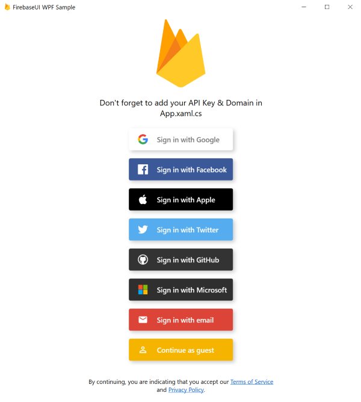

# FirebaseAuthentication.net
[](https://github.com/step-up-labs/firebase-authentication-dotnet/actions)
[](https://www.nuget.org/packages/FirebaseAuthentication.net)
[](https://f.feedz.io/step-up-labs/firebase/packages/FirebaseAuthentication.net/latest/download)

FirebaseAuthentication.net is an unofficial C# implementation of [Firebase Authentication](https://firebase.google.com/docs/auth)
and [FirebaseUI](https://firebase.google.com/docs/auth). 

The libraries provide a drop-in auth solution that handles the flows for signing in users with email addresses and passwords, Identity Provider Sign In including Google, Facebook, GitHub, Twitter, Apple, Microsoft and anonymous sign-in.

The solution consists of 4 libraries - a base one and 3 platform specific ones:
* FirebaseAuthentication<strong>.net</strong> targets [.NET Standard 2.0](https://github.com/dotnet/standard/blob/master/docs/versions.md)
* FirebaseAuthentication<strong>.WPF</strong> targets [WPF on .NET Core 3.1](https://github.com/dotnet/wpf)
* FirebaseAuthentication<strong>.UWP</strong> targets UWP (*TODO*)
* FirebaseAuthentication<strong>.Xamarin</strong> targets Xamarin.Forms (*TODO*)

## Installation

Either via Visual Studio [Nuget](https://www.nuget.org/packages/FirebaseAuthentication.net) package manager, or from command line:

```powershell
# base package
dotnet add package FirebaseAuthentication.net

# Platform specific FirebaseUI (has dependency on base package)
dotnet add package FirebaseAuthentication.WPF
dotnet add package FirebaseAuthentication.UWP
dotnet add package FirebaseAuthentication.Xamarin
```

Use the `--version` option to specify a [preview version](https://www.nuget.org/packages/FirebaseAuthentication.net/absoluteLatest) to install.

Daily preview builds are also available on [feedz.io](https://feedz.io). Just add the following Package Source to your Visual Studio:

```
https://f.feedz.io/step-up-labs/firebase/nuget/index.json
```

## Usage

In general the terminology and API naming conventions try to follow the official JavaScript implementation, adjusting it to fit the .NET conventions. 
E.g. `signInWithCredential` is called `SignInWithCredentialAsync` because it is meant to be `await`ed, but otherwise the terminology should be mostly the same.


### Samples
There are currently 2 sample projects in the [samples folder](/samples/):

* .NET Core Console application (uses only the base library, no UI)
* WPF sample with UI

Feel free to clone the repo and check them out, just don't forget to add your custom API keys and other setup (typically in `Program.cs` or `App.xaml.cs`).



### Setup

For general Firebase setup, refer to the [official documentation](https://firebase.google.com/docs/auth) which discusses the general concepts and individual providers in detail. 
You might also want to check out the first two steps in this [web documentation](https://firebase.google.com/docs/web/setup). 
Notice that Firebase doesn't officially support Windows as a platform so you will have to register your application as a web app in [Firebase Console](https://console.firebase.google.com/).

### FirebaseAuthentication.net

The base library gives you the same features as the official *Firebase SDK Authentication*, that is without any UI. Your entrypoint is the `FirebaseAuthClient`.

```csharp
// Configure...
var config = new FirebaseAuthConfig
{
    ApiKey = "<API KEY>",
    AuthDomain = "<DOMAIN>.firebaseapp.com",
    Providers = new FirebaseAuthProvider[]
    {
        // Add and configure individual providers
        new GoogleProvider().AddScopes("email"),
        new EmailProvider()
        // ...
    },
    UserRepository = new FileUserRepository("FirebaseSample")
};

// ...and create your FirebaseAuthClient
var client = new FirebaseAuthClient(config);
```

Notice the `UserRepository`. This tells `FirebaseAuthClient` where to store the user's credentials. 
By default the libraries use in-memory repository; to preserve user's credentials between application runs, use `FileUserRepository` (or your custom implementation of `IUserRepository`).

After you have your `client`, you can sign-in or sign-up the user with any of the configured providers.

```csharp
using Firebase.Auth;
using Firebase.Auth.Providers;

// anonymous sign in
var user = await client.SignInAnonymouslyAsync();

// sign up or sign in with email and password
var user = await client.CreateUserWithEmailAndPasswordAsync("email", "pwd", "Display Name");
var user = await client.SignInWithEmailAndPasswordAsync("email", "pwd");

// sign in via provider specific AuthCredential
var credential = TwitterProvider.GetCredential("access_token", "oauth_token_secret");
var user = await client.SignInWithCredentialAsync(credential);

// sign in via web browser redirect - navigate to given uri, monitor a redirect to 
// your authdomain.firebaseapp.com/__/auth/handler
// and return the whole redirect uri back to the client;
// this method is actually used by FirebaseUI
await client.SignInWithRedirectAsync(provider, async uri =>
{    
    return await OpenBrowserAndWaitForRedirectToAuthDomain(uri);
});
```

As you can see the sign-in methods give you a `User` object, which contains information about a user as well as some useful method, e.g. `GetIdTokenAsync()` to get a valid *IdToken* you can use as an access token to other Firebase API (e.g. Realtime Database).

```csharp
// user and auth properties
var uid = user.Uid;
var name = user.Info.DisplayName; // more properties are available in user.Info
var refreshToken = user.Credential.RefreshToken; // more properties are available in user.Credential

// user methods
var token = await user.GetIdTokenAsync();
await user.DeleteAsync();
await user.ChangePasswordAsync("new_password");
await user.LinkWithCredentialAsync(authCredential)
```

### FirebaseUI

The platform specific UI libraries use the `FirebaseAuthClient` under the hood, but need to be initilized via the static `Initialize` method of `FirebaseUI`:

```csharp
// Initialize FirebaseUI during your application startup (e.g. App.xaml.cs)
FirebaseUI.Initialize(new FirebaseUIConfig
{
    ApiKey = "<API KEY>",
    AuthDomain = "<DOMAIN>.firebaseapp.com",
    Providers = new FirebaseAuthProvider[]
    {
        new GoogleProvider().AddScopes("email"),
        new EmailProvider()
        // and others
    },
    PrivacyPolicyUrl = "<PP URL>",
    TermsOfServiceUrl = "<TOS URL>",
    IsAnonymousAllowed = true,
    UserRepository = new FileUserRepository("FirebaseSample") // persist data into %AppData%\FirebaseSample
});
```

Notice the `UserRepository`. This tells FirebaseUI where to store the user's credentials. 
By default the libraries use in-memory repository; to preserve user's credentials between application runs, use `FileUserRepository` (or your custom implementation of `IUserRepository`).

FirebaseUI comes with `FirebaseUIControl` you can use in your xaml as follows:

```xml
<!--WPF Sample-->
<Page x:Class="Firebase.Auth.Wpf.Sample.LoginPage"
      xmlns="http://schemas.microsoft.com/winfx/2006/xaml/presentation"
      xmlns:x="http://schemas.microsoft.com/winfx/2006/xaml"
      xmlns:mc="http://schemas.openxmlformats.org/markup-compatibility/2006" 
      xmlns:d="http://schemas.microsoft.com/expression/blend/2008" 
      xmlns:firebase="clr-namespace:Firebase.Auth.UI;assembly=Firebase.Auth.UI.WPF"
      mc:Ignorable="d" 
      d:DesignHeight="450" 
      d:DesignWidth="800">

    <Grid>
        <firebase:FirebaseUIControl>
            <firebase:FirebaseUIControl.Header>
                <!--Custom content shown above the provider buttons-->
                <Image 
                    Height="150"
                    Source="/Assets/firebase.png"
                    />
            </firebase:FirebaseUIControl.Header>
        </firebase:FirebaseUIControl>
    </Grid>
</Page>
```

Toggling the visibility of this UI control is up to you, depending on your business logic. 
E.g. you could show it as a popup, or a `Page` inside a `Frame` etc. 
You would typically want to toggle the control's visibility in response to the `AuthStateChanged` event:

```csharp
// subscribe to auth state changes
FirebaseUI.Instance.Client.AuthStateChanged += this.AuthStateChanged;

private void AuthStateChanged(object sender, UserEventArgs e)
{
    // the callback is not guaranteed to be on UI thread
    Application.Current.Dispatcher.Invoke(() =>
    {
        if (e.User == null)
        {
            // no user is signed in (first run of the app, user signed out..), show login UI 
            this.ShowLoginUI();
        }
        else if (!this.loginUIShowing)
        {
            // user signed in (or was already signed in), hide the login UI
            // this event can be raised multiple times (e.g. when access token gets refreshed), you need to be ready for that
            this.HideLoginUI();
        }
    });
}
```